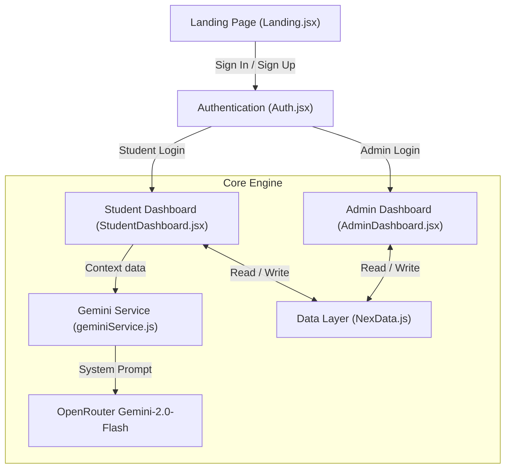

# 🎓 Nexora — AI-Powered Academic Intelligence Platform

<p align="center">
  
</p>

<p align="center">
  <strong>A premium, responsive, and context-aware Academic Portal designed for students and administrators.</strong>
</p>

<p align="center">
  <a href="https://react.dev/"></a>
  <a href="https://vite.dev/"></a>
  <a href="https://chartjs.org/"></a>
  <a href="https://openrouter.ai/"></a>
</p>

---

## 🌟 Project Overview

**Nexora** transitions standard static academic boards into a proactive, intelligent dashboard. By blending rich data visualizations (powered by Chart.js) with a context-aware **Gemini AI Assistant** (via OpenRouter), Nexora provides real-time tracking, risk flags, and custom study support.

The platform splits securely into two interfaces depending on user credentials:
1. **Student Dashboard:** Real-time GPA analysis, attendance status triggers, personalized timetable scheduling, and task management.
2. **Admin Dashboard:** Roster managers (CRUD), automated grade calculations, at-risk flags (GPA < 2.0 / attendance < 65%), and system announcement broadcasts.

---

## ⚡ Key Features

### 👤 Student Experience
* **Real-Time GPA Tracking:** Automatic computation of GPA on a 4.0 scale based on grade points and course credits.
* **Attendance Safeguards:** Color-coded status displays (Safe: $\ge$ 80%, Warning: 65-80%, Critical: < 65%) with exam eligibility warnings.
* **Interactive Timetables:** Weekly calendars allowing students to overlay personal entries on top of official classes.
* **Visual Analytics:** Multiple visual representations including line graphs (GPA history), radar charts (skills metrics), and doughnut charts (grade allocations).

### 🔑 Administrator Control Room
* **Student Directory CRUD:** Manage, search, filter, and modify student databases cleanly.
* **Interactive Gradebook:** Edit marks per subject, automatically converting scores into letter grades (A, B+, C, etc.).
* **Proactive At-Risk Flags:** Visually isolates students whose performance or attendance falls into critical levels.
* **Announcement Broadcaster:** Draft announcements with targets (students/admins) and categories (warnings, updates).

### 🤖 Context-Aware AI Assistant
* Connects dynamically to your academic logs in `localStorage`.
* Reads your weakest subject, your attendance levels, and today's schedule.
* Proactively highlights issues and guides you through exam study preparations in a conversation.

---

## 🏗️ Architecture



---

## 🛠️ Technology Stack

| Component | Technology | Description |
| :--- | :--- | :--- |
| **Frontend Framework** | React 19 + Vite | SPA framework with optimized chunk loading |
| **Routing** | React Router Dom v7 | Handles client-side redirection and lazy-loaded routes |
| **Visual Charts** | Chart.js & `react-chartjs-2` | Rendering complex, responsive canvas charts |
| **Styling** | Vanilla CSS3 (Custom Variables) | Modern dark-theme configuration and smooth transitions |
| **Mock Database** | Browser LocalStorage | Seamless data persistence across visits and sessions |
| **AI Integration** | OpenRouter (Gemini 2.0 Flash) | API integration generating context-aware answers |

---

## 🚀 Installation & Local Setup

### Prerequisites
Make sure you have [Node.js](https://nodejs.org/) installed (v18+ recommended).

### 1. Clone the repository & install dependencies
```bash
git clone https://github.com/VishnuVardhan-719/Nexora.git
cd Nexora
npm install
```

### 2. Configure Environment Variables
Create a `.env` file in the root folder (or copy `.env.example`):
```bash
cp .env.example .env
```
Open `.env` and add your OpenRouter API key:
```env
VITE_OPENROUTER_API_KEY=your_key_here
```
> 💡 *Note: You can generate a free OpenRouter API key at [openrouter.ai/keys](https://openrouter.ai/keys).*

### 3. Run Development Server
```bash
npm run dev
```
Open your browser and navigate to the local host address provided in the terminal (usually `http://localhost:5173`).

---

## 🔑 Demo Access Credentials
You can log in to either dashboard immediately using these pre-seeded demo accounts:

* **Student Account:**
  * **Email:** `arjun@nexora.edu`
  * **Password:** `student123`
* **Admin Account:**
  * **Email:** `admin@nexora.edu`
  * **Password:** `admin123`

---

## 🛡️ License
Distributed under the MIT License. See `LICENSE` for more information.
